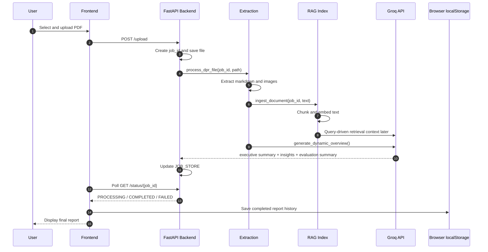

# DPR Compliance Analysis System: Architecture, Flow, and Interview Brief

## 1. System Purpose

This workspace implements an AI-assisted DPR review platform for Detailed Project Reports used in government infrastructure workflows. The system is designed to reduce manual review time by combining:

- PDF document extraction
- image preservation
- semantic retrieval with embeddings and vector search
- multi-stage LLM analysis
- a browser-based dashboard for upload, polling, and report review

The current implementation is a two-part application:

- Backend: FastAPI service in `backend/`
- Frontend: React + TypeScript app in `Frontend-DPR/`

The core runtime flow is:

1. User uploads a DPR PDF.
2. Backend stores the file and starts background processing.
3. Document text and images are extracted.
4. Extracted text is chunked and indexed in local Qdrant using Sentence-Transformers embeddings.
5. Groq LLM calls generate an executive summary, dynamic agent insights, and a final evaluation summary.
6. Frontend polls job status until the report is ready.
7. Completed reports are stored in browser localStorage for history and review.

## 2. High-Level Architecture

```mermaid
flowchart LR
    U[User in Browser] --> F[React Frontend\nFrontend-DPR/]
    F -->|POST /upload| A[FastAPI Backend\nbackend/main.py]
    F -->|GET /status/{job_id}| A
    F -->|GET /report/{job_id}| A
    F -->|POST /chat| A

    A --> S[services.py\nJob orchestration]
    S --> X[extraction.py\nPyMuPDF text + image extraction]
    S --> R[rag_service.py\nSentence-Transformers + Qdrant]
    S --> O[overview_analysis.py\nGroq multi-stage analysis]

    R --> Q[(Local Qdrant store\nlocal_qdrant_data/)]
    X --> I[(uploads/images/{job_id}/)]
    A --> J[(In-memory JOB_STORE)]
    O --> G[(Groq API)]

    F --> L[(Browser localStorage)]
```

## 3. Backend Architecture

### 3.1 Entry Point and API Layer

The backend entry point is `backend/main.py`. It exposes the public API surface and connects FastAPI routes to the service layer.

Implemented endpoints:

- `GET /health` for health checks
- `POST /upload` for file upload and job creation
- `GET /status/{job_id}` for polling job state
- `GET /report/{job_id}` for full report retrieval
- `POST /chat` for RAG-based document Q&A

The backend uses CORS configured from `backend/config.py`, so the frontend can access it during local development.

### 3.2 Orchestration Layer

`backend/services.py` is the main orchestration module.

What it does:

- creates a job record in an in-memory `JOB_STORE`
- runs extraction
- ingests extracted text into the RAG index
- calls the LLM-based overview generator
- updates job status to `COMPLETED` or `FAILED`

This layer is the real control plane of the application. It is intentionally thin, which keeps the execution flow easier to reason about.

### 3.3 Extraction Layer

`backend/extraction.py` uses PyMuPDF (`fitz`) to:

- open the PDF
- extract page text blocks
- preserve page structure in markdown form
- detect and store embedded images per job

Important implementation detail:

- headers are inferred with a simple heuristic
- extracted images are written to `uploads/images/{job_id}/`
- if the document has no extractable text, the code raises an error instead of silently succeeding

This is a good example of execution quality because it prefers explicit failure over producing misleading output.

### 3.4 RAG Layer

`backend/rag_service.py` implements `FlexibleDocumentRAG`.

It uses:

- `sentence-transformers` for local embeddings
- `QdrantClient` with a local on-disk store at `local_qdrant_data/`
- collection-based vector indexing
- payload filtering by `job_id` to isolate one document from another

The RAG pipeline works as follows:

1. markdown is split into logical chunks
2. chunks are batched in groups of 20 for embedding
3. embeddings are upserted to Qdrant with metadata
4. queries retrieve only chunks matching the current `job_id`

This gives the system document-specific retrieval without needing a separate collection per upload.

### 3.5 LLM Analysis Layer

`backend/overview_analysis.py` is the most distinctive part of the solution.

It performs a three-stage analysis with Groq:

1. Executive summary and dynamic persona discovery
2. Persona-specific analysis using RAG-retrieved context
3. Final synthesis into an evaluation summary

This is not a fixed-template analysis. The system dynamically decides which specialist perspectives are needed based on document content.

If `GROQ_API_KEY` is missing, the backend returns a mock `AnalysisReport` instead of failing outright. That is useful for demos and keeps the system runnable during setup.

### 3.6 Job State and Stability Model

The current job state is kept in memory in `JOB_STORE`.

That means:

- reports are available only while the backend process is alive
- a backend restart clears active and completed job state
- there is no durable database-backed job history

This is acceptable for a prototype or interview demo, but it is also the main stability limitation to acknowledge honestly.

## 4. Frontend Architecture

### 4.1 Entry and Routing

The frontend root is `Frontend-DPR/src/App.tsx`, which wraps the application in an auth provider and router.

`Frontend-DPR/src/router/AppRouter.tsx` controls the user flow:

- unauthenticated users go to `/login`
- authenticated users enter the main layout
- the main routes include dashboard, upload, analysis, reports, geospatial verification, settings, profile, documents, and help

### 4.2 Layout and UI Composition

`Frontend-DPR/src/layout/MainLayout.tsx` is the shell of the application.

It combines:

- government-style header
- collapsible sidebar
- footer
- floating chatbot button and drawer

This gives the product a stable enterprise-style interface rather than a single-page utility screen.

### 4.3 State Management

The frontend uses simple but effective state patterns:

- `useAuth.tsx` stores the signed-in user in localStorage
- `useChatbot.ts` keeps chatbot visibility, messages, and input state
- `AnalysisDashboard.tsx` manages upload, processing, and results states

This is pragmatic for the current scope. The application does not depend on a heavy global state library.

### 4.4 Analysis Experience

`Frontend-DPR/src/pages/Analysis/AnalysisDashboard.tsx` is the main end-to-end user experience.

It performs:

- file selection via drag and drop
- upload to the backend
- polling `/status/{job_id}` every few seconds
- rendering executive summary, insights, evaluation summary, and extracted visuals
- saving completed reports to browser localStorage under `dpr_reports`

This page is the clearest evidence of system integration because it orchestrates the full backend lifecycle from the user’s point of view.

### 4.5 Reports and History

`Frontend-DPR/src/pages/Reports.tsx` reads `dpr_reports` from localStorage and provides a history list.

That means report history is client-side, not server-side.

This is useful for demo continuity, but it is not a production-grade persistence strategy.

## 5. Process Flow



### Step-by-step explanation

1. The user uploads a PDF from the analysis page.
2. The backend validates the file extension and stores the upload.
3. A background task starts document processing.
4. PyMuPDF extracts text and images from the document.
5. The extracted markdown is chunked and embedded locally.
6. Qdrant stores vectors with job-specific payload metadata.
7. Groq generates a structured report in multiple passes.
8. The frontend polls job status until the report is complete.
9. The UI renders the report and saves it locally for history.

## 6. Integration Map

### Active integrations

- Groq API for LLM reasoning
- Sentence-Transformers for embeddings
- Qdrant for vector retrieval
- PyMuPDF for PDF extraction
- React Dropzone for upload UX
- Material UI for the interface shell
- localStorage for lightweight auth and report persistence

### Declared but only partially used or not fully wired

- Celery and Redis are present in the backend dependencies, but the current flow relies on FastAPI background tasks and an in-memory store
- the frontend API layer defines many endpoints for compliance, feasibility, consistency, and risk analysis that are not implemented by the current backend
- the chatbot is wired to `/chat`, but its UI state and retrieval flow are simpler than the broader API surface suggests

## 7. What To Say For Each Evaluation Criterion

### 7.1 Execution Quality and System Stability

What to highlight:

- the pipeline is staged and observable: upload, extraction, indexing, analysis, polling, report rendering
- errors are handled explicitly rather than hidden
- image extraction failures do not crash the full analysis
- if Groq is unavailable or misconfigured, the system returns a mock analysis instead of failing completely
- document retrieval is isolated per `job_id`, which prevents mixing results from different uploads

Be honest about the stability limitations:

- `JOB_STORE` is in-memory, so jobs are not durable across restarts
- frontend polling has no hard timeout or circuit breaker
- scanned-image-only PDFs can fail because the current extractor depends on PyMuPDF text extraction rather than a dedicated OCR engine
- report history is stored in browser localStorage, not a shared backend database

### 7.2 Technical Complexity and Integrations

What to highlight:

- the system combines a document parser, a vector database, and an LLM in one workflow
- the retrieval layer is document-specific through vector filtering by job ID
- the LLM logic is multi-stage rather than a single prompt call
- embeddings are generated locally, which reduces external dependence for retrieval
- the frontend is not just a form; it coordinates upload, background processing, polling, and history storage

Why this matters:

- the project is more than a UI plus a single API call
- it integrates asynchronous processing with semantic search and structured reasoning
- the architecture supports future expansion into deeper compliance modules

### 7.3 Architecture Design and Implementation Logic

What to explain:

- `main.py` is thin and focuses on HTTP boundaries
- `services.py` orchestrates the business flow
- `extraction.py` handles document parsing and artifact capture
- `rag_service.py` turns extracted text into queryable knowledge chunks
- `overview_analysis.py` converts retrieved evidence into a structured assessment

This separation of concerns makes the system easier to extend:

- swap extraction logic without changing the API
- replace the vector database without redesigning the frontend
- improve the LLM prompts without changing upload or routing

### 7.4 Domain Knowledge and Problem Solving

What to highlight:

- DPRs have structured content, cross-references, and section-level evidence requirements
- compliance review needs more than keyword matching; it needs context-aware retrieval and judgment
- the system is designed around government-review workflows, not generic document chat
- the report output includes executive summary, risk flags, missing sections, and recommendations, which matches real assessment behavior

This shows domain understanding because the solution is optimized for how a human reviewer actually thinks about a DPR.

### 7.5 Originality of the Solution

What to highlight:

- the system dynamically discovers specialist AI personas from the document content
- it uses a chief-assessor synthesis step to merge those viewpoints into one report card
- it preserves images from the source PDF rather than flattening everything into text only
- it combines retrieval and reasoning in a way that is tailored to DPR review

This is a stronger story than “we built a chat app over documents.” The novelty is the document-aware multi-agent review pattern.

## 8. Strengths You Can Defend

- Clear end-to-end processing pipeline
- Good separation between API, service orchestration, extraction, retrieval, and reasoning
- Local embeddings and local Qdrant make the system practical for demos and offline testing
- `job_id` scoping avoids cross-document contamination
- graceful fallback for missing LLM credentials
- report persistence in the browser improves usability without requiring a database
- frontend and backend are both organized into readable modules

## 9. Caveats You Should Mention If Asked

Mention these only if the interviewer asks about limitations or production readiness:

- job state is not persisted in a database
- polling can wait indefinitely if the backend dies mid-job
- OCR is not fully hybrid in the current code path
- some frontend API functions point to endpoints that are not implemented in the active backend
- authentication is UI-level only and not enforced server-side

## 10. Short Interview Script

Use this if you need a compact verbal explanation:

> This system is a FastAPI and React-based DPR review platform. A user uploads a PDF, the backend extracts text and images with PyMuPDF, chunks and embeds the content with Sentence-Transformers, stores it in Qdrant with job-level isolation, and then uses Groq in a multi-stage analysis flow to generate an executive summary, specialist insights, and a final evaluation summary. The frontend polls job status, renders the report, and keeps a local report history. The key engineering value is that the solution combines document extraction, semantic retrieval, and structured LLM reasoning in a workflow designed for government DPR assessment.

## 11. File References For Deeper Review

- Backend API and endpoints: [backend/main.py](backend/main.py)
- Job orchestration: [backend/services.py](backend/services.py)
- Document extraction: [backend/extraction.py](backend/extraction.py)
- Vector retrieval: [backend/rag_service.py](backend/rag_service.py)
- LLM report generation: [backend/overview_analysis.py](backend/overview_analysis.py)
- Response models: [backend/schemas.py](backend/schemas.py)
- Backend settings: [backend/config.py](backend/config.py)
- Frontend router: [Frontend-DPR/src/router/AppRouter.tsx](Frontend-DPR/src/router/AppRouter.tsx)
- Main analysis experience: [Frontend-DPR/src/pages/Analysis/AnalysisDashboard.tsx](Frontend-DPR/src/pages/Analysis/AnalysisDashboard.tsx)
- Report history: [Frontend-DPR/src/pages/Reports.tsx](Frontend-DPR/src/pages/Reports.tsx)
- Authentication context: [Frontend-DPR/src/hooks/useAuth.tsx](Frontend-DPR/src/hooks/useAuth.tsx)
- Chatbot logic: [Frontend-DPR/src/hooks/useChatbot.ts](Frontend-DPR/src/hooks/useChatbot.ts)

## 12. Bottom Line

This is a credible architecture for an AI-assisted DPR review assistant because it combines document extraction, retrieval, and report synthesis in a structured way. The strongest interview angle is not just that it uses AI, but that it applies AI in a domain-specific workflow with job isolation, evidence retrieval, and staged reasoning.

If you present it well, the story is:

- a real problem
- a layered architecture
- meaningful integrations
- a clear reasoning pipeline
- and a practical, explainable design choice at each step