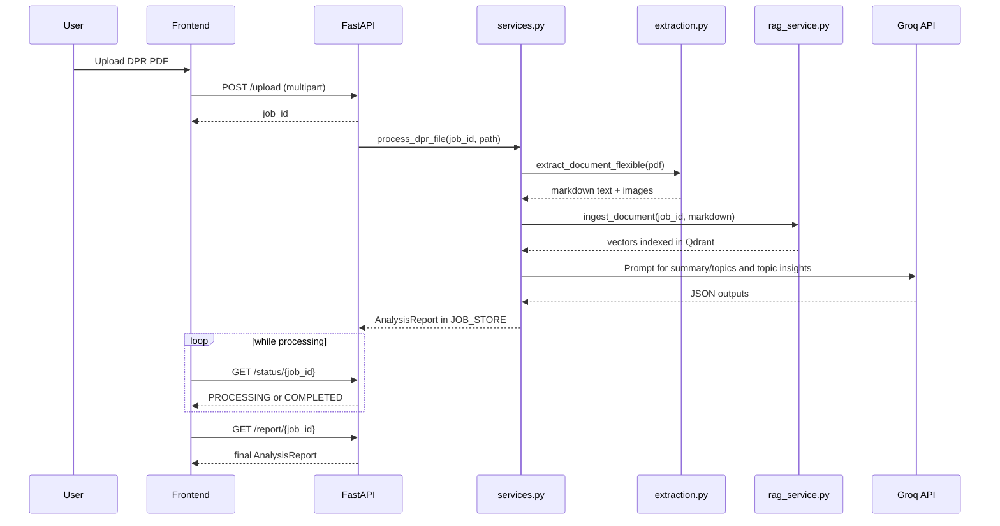

# DPR Compliance Analysis System - Architecture and Working Guide

This document explains what the project does, how the end-to-end pipeline works, and how each module contributes to AI-assisted DPR analysis.

---

## 1. Objective

The system automates review of long DPR documents (often 200+ pages) and generates a structured assessment using:

- text and image extraction from PDF
- semantic retrieval with embeddings and vector search
- LLM-based reasoning and summarization
- a dashboard-ready report with risks, insights, and recommendations

Primary goal: reduce manual review effort while preserving traceability to source content.

---

## 2. High-Level Architecture

```mermaid
graph TD
    subgraph FE [Frontend - React + Vite]
        A1[Upload DPR PDF]
        A2[Status Polling]
        A3[Dashboard + Chat View]
    end

    subgraph BE [Backend - FastAPI]
        B1[/POST /upload/]
        B2[Background Processing]
        B3[PDF Extraction Layer]
        B4[RAG Index + Query]
        B5[LLM Insight Generation]
        B6[/GET /status/{job_id}/]
        B7[/GET /report/{job_id}/]
    end

    subgraph STORE [Data Stores]
        C1[(uploads/ files)]
        C2[(Qdrant local collection)]
        C3[(In-memory JOB_STORE)]
    end

    subgraph EXT [External Service]
        D1[Groq API]
    end

    A1 --> B1
    B1 --> C1
    B1 --> B2
    B2 --> B3
    B3 --> B4
    B4 --> C2
    B5 --> D1
    B2 --> B5
    B2 --> C3
    A2 --> B6
    B6 --> C3
    A3 --> B7
    B7 --> C3
```

### Core design choices

- FastAPI background task model (simple hackathon-friendly async processing)
- Local vector store (Qdrant path-based storage) to avoid external DB setup
- Local embeddings with sentence-transformers for deterministic retrieval
- Cloud LLM via Groq for fast reasoning and structured JSON generation

---

## 3. Runtime Workflow (Sequence Diagram)



---

## 4. Backend Module Responsibilities

### main.py

- defines API endpoints and CORS
- validates uploaded file extension (.pdf)
- generates short job id
- starts background processing
- serves status and report retrieval

### services.py

- orchestrates full processing pipeline
- stores current job state in in-memory JOB_STORE
- handles fail-safe transitions (PROCESSING -> COMPLETED/FAILED)
- computes and records processing time

### extraction.py

- reads PDF using PyMuPDF
- extracts text blocks page-wise and builds markdown
- applies basic header heuristics
- extracts images and stores them in uploads/images/{job_id}

### rag_service.py

- chunks markdown (header-aware chunking)
- computes embeddings using all-MiniLM-L6-v2
- upserts vectors with payload metadata into Qdrant
- serves semantic search scoped by job_id

### overview_analysis.py

- calls Groq model for:
  - executive summary + dynamic topic discovery
  - topic-wise insights (details, risks, extracted values)
  - final synthesis (flagged risks, missing sections, recommendations)
- builds final AnalysisReport schema object
- includes fallback behavior for API failures/quota issues

### schemas.py

- strongly typed response contracts:
  - AnalysisReport
  - DynamicInsight
  - EvaluationSummary
  - UploadResponse / StatusResponse

---

## 5. API Contract (Current Active Backend)

### GET /health

Returns service health and version.

### POST /upload

Input: multipart/form-data with file

Output example:

```json
{
  "job_id": "A1B2C3D4",
  "message": "File uploaded successfully"
}
```

### GET /status/{job_id}

Returns processing state. Includes report payload only when completed or failed.

### GET /report/{job_id}

Returns full AnalysisReport for completed jobs.

---

## 6. Data and Storage Model

- Upload artifacts: uploads/
- Extracted images: uploads/images/{job_id}/
- Vector DB path: local_qdrant_data/
- Job result cache: in-memory JOB_STORE dictionary

Important implication: job status is not persisted across backend restarts because JOB_STORE is memory-based.

---

## 7. Frontend Role in the Flow

The React app provides:

- document upload UX
- dashboard cards/charts for insights
- assistant panel for interactive queries
- report export utilities (PDF/Excel support in dependencies)

Note: there are service definitions in frontend for a broader endpoint set. The currently active backend in this repository exposes upload/status/report/health flow. If needed, align frontend API base and endpoint mapping before production demo.

---

## 8. Configuration

Key backend settings are loaded from environment via pydantic settings:

- GROQ_API_KEY
- GROQ_MODEL_NAME (default: llama-3.3-70b-versatile)
- LOCAL_EMBEDDING_MODEL (default: all-MiniLM-L6-v2)
- QDRANT_LOCAL_PATH
- UPLOADS_DIR
- ALLOWED_ORIGINS

---

## 9. Hackathon Runbook

### Start backend

```bash
python -m venv .venv
source .venv/bin/activate
pip install -r backend/requirements.txt
uvicorn backend.main:app --reload --port 8000
```

### Start frontend

```bash
cd Frontend-DPR
npm install
npm run dev
```

### Demo script

1. Upload a large DPR PDF
2. Show returned job id
3. Poll status until completed
4. Open final report view
5. Highlight extracted values and flagged risks

---

## 10. Known Constraints and Risks

- table extraction quality depends on PDF structure and text block layout
- in-memory job tracking is not durable
- extraction heuristics for headers are simple and may misclassify lines
- API call volume and token limits depend on Groq account quota
- no authentication/authorization layer in active backend endpoints

---

## 11. Practical Next Improvements (Low Complexity)

1. Persist job states to Redis or SQLite to survive restarts.
2. Add source citation payload (page/chunk id) per extracted value.
3. Introduce a compact DPR financial schema for fixed fields (material cost, labor cost, total project cost).
4. Add retry with exponential backoff for Groq API transient failures.
5. Add one integration test for upload -> status -> report happy path.

---

## 12. Summary

This repository already contains a complete AI-assisted DPR processing pipeline suitable for a hackathon demo:

- upload and asynchronous processing
- extraction + vector indexing + semantic retrieval
- LLM-driven structured analysis
- frontend dashboard presentation

The architecture is intentionally pragmatic: fast to run locally, easy to explain, and extensible for production hardening.